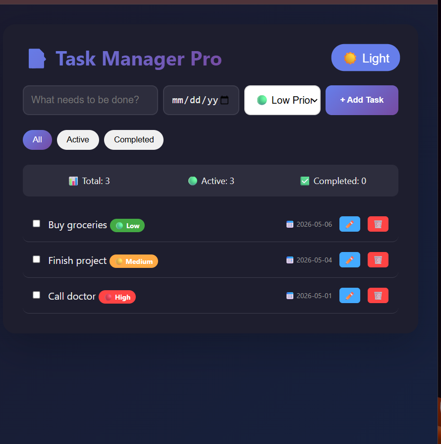

# Task Manager Pro

A feature-rich task management app with dark mode, due dates, and priority levels.

## Live Demo

**View the live app:** https://celadon-cuchufli-38a1a4.netlify.app

## Features

- ✅ Add, edit, and delete tasks
- ✅ Mark tasks as complete/incomplete
- ✅ Filter tasks (All / Active / Completed)
- ✅ Dark mode toggle
- ✅ Priority levels (Low, Medium, High)
- ✅ Due date picker
- ✅ Data saves automatically (localStorage)

## Screenshots

| Light Mode | Dark Mode | Filter View |
|------------|-----------|-------------|
|  |  |  |

## Technologies Used

- HTML5
- CSS3 (with CSS variables for theming)
- JavaScript (ES6+)
- LocalStorage API

## How to Use

1. **Add task:** Type task name, select due date and priority, click "Add Task"
2. **Complete task:** Click the checkbox next to any task
3. **Edit task:** Click edit icon (pencil)
4. **Delete task:** Click delete icon (trash can)
5. **Filter tasks:** Use All/Active/Completed buttons
6. **Dark mode:** Click the moon/sun icon in header

## Run Locally

```bash
git clone https://github.com/munat77/task-manager.git
cd task-manager
open index.html
